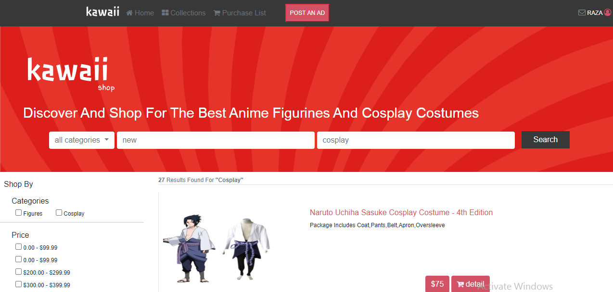
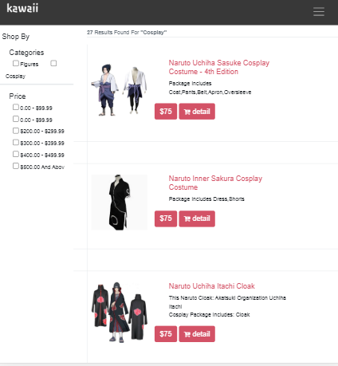

## KAWAII SHOP

this project is based on e-commerce Designed by [Mohammed Awad](https://www.behance.net/M_Awad) it was made for shopping and selling
different products.
here is my capstone project HTML CSS with the name "Kawaii shop"
in this project :

- I used HTML, CSS, and bootstrap
- semantic HTML tags
- this project has two pages the first page is the home page and the second is the result of search

## Built With

- HTML
- CSS

## Live Demo home page

[Live Demo Link](https://rawcdn.githack.com/rahalrazika/online-shop/992908598dc98e485f2098f204a34c6179295081/index.html)

## Live Demo resault search

[Live Demo Link](https://rawcdn.githack.com/rahalrazika/online-shop/2248396750c5913870d473553fec48755f05cb45/search.html)

## Getting Started

**To view this project, download the contents of the repository to your computer or clone the repository and open the index.html file using your preferred browser.**

## Authors

¤ **Razika**

- Github: [@rahalrazika](https://github.com/rahalrazika)
- Linkedin : [@razika rahal](https://www.linkedin.com/in/razika-rahal-85539bbb/)
- Twitter: [@RereRere055](https://twitter.com/RereRere055)

## Contributing

Contributions, issues and feature requests are welcome!

## Show your support

Give a  if you like this project

## Acknowledgments

- Design by [Mohammed Awad](https://www.behance.net/M_Awad)
- Microverse
