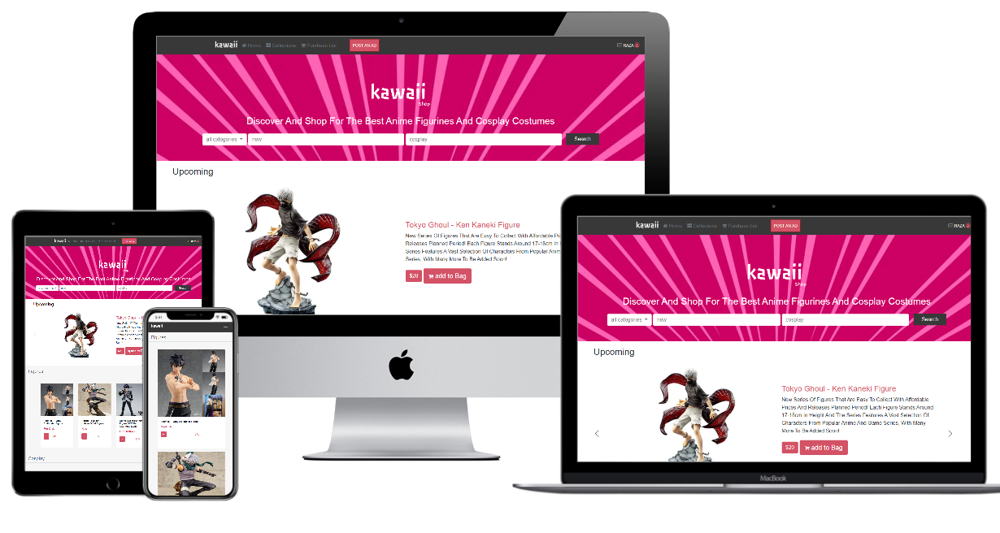

## KAWAII SHOP

This project is based on an e-commerce site Designed by Mohammed Awad, and I made it to help otakus shop and sell different products online. This is my capstone project for the HTML and CSS module in the Microverse Program. The name of this project is "Kawaii shop."

- I used HTML, CSS, and bootstrap
- It has semantic HTML tags
- This project has two pages -- the first page is the home page and the second is the search results page

## Built With

- HTML
- CSS

## Live Demo home page

[Live Demo Link](https://rawcdn.githack.com/rahalrazika/online-shop/53e18ccb4df4c1399764fd16edf60d3b355ac6e8/index.html)

## Getting Started

**To view this project, download the contents of the repository to your computer or clone the repository and open the index.html file using your preferred browser.**

## Author

 **Razika**

- Github: [@rahalrazika](https://github.com/rahalrazika)
- Linkedin : [Razika Rahal](https://www.linkedin.com/in/razika-rahal-85539bbb/)
- Twitter: [@RereRere055](https://twitter.com/RereRere055)

## Contributing

Contributions, issues and feature requests are welcome!

## Show your support

Give a  if you like this project

## Acknowledgments

- Design by [Mohammed Awad](https://www.behance.net/M_Awad)
- Microverse
